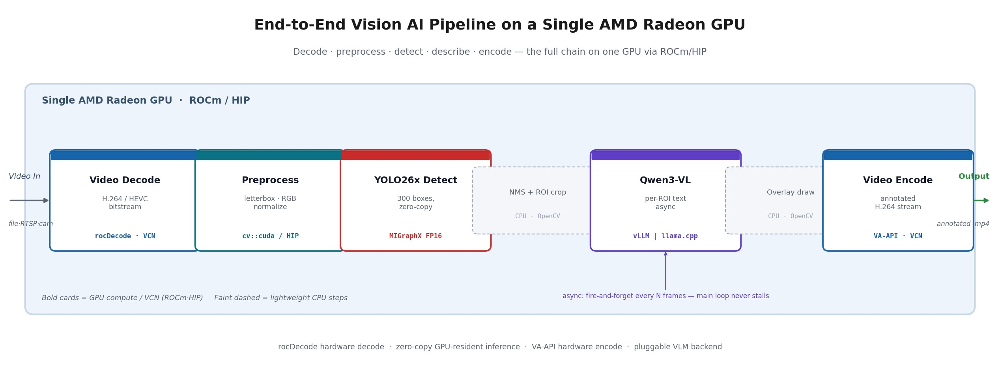

# Building an End-to-End Vision AI Pipeline on a Single AMD Radeon GPU

Modern computer-vision applications rarely consist of a single model. A useful
"video understanding" system needs to *decode* frames, *preprocess* them,
*detect* objects, and increasingly, *describe* what it sees in natural language.
Each of those stages has traditionally lived in its own runtime — often on its
own accelerator.

This post walks through a working demo that collapses that whole chain onto **one
AMD Radeon GPU**, end to end, using the ROCm/HIP software stack. Hardware video
decoding on the VCN engine, HIP-accelerated OpenCV preprocessing, YOLO26x object
detection through MIGraphX, a Qwen3-VL vision-language model for scene
understanding, and hardware video encoding all run on the same card — no second
GPU, no CPU offload for the heavy stages. From the compressed bitstream in to the
annotated bitstream out, the frame data never has to leave the GPU.

The point of the demo is **functional completeness on a single device**: it shows
that a full detect-then-describe vision pipeline *fits and runs* on one Radeon
GPU. We deliberately keep performance numbers out of the spotlight here; the
focus is the architecture and the fact that it all co-exists on one piece of
silicon.



## The pipeline at a glance

```
Video Input (file · RTSP · camera)
        │
        ▼
Video Decode                 rocDecode · VCN
  • H.264 / HEVC bitstream → RGB surface in VRAM
        │
        ▼
OpenCV 5.x Preprocess        cv::cuda / HIP
  • warpAffine (letterbox), normalize — zero-copy over the decoded surface
        │
        ▼
YOLO26x Detection            MIGraphX FP16 (zero-copy)
  • 300 candidate boxes → [x1, y1, x2, y2, score, class]
        │
        ▼
NMS + ROI Crop               CPU · OpenCV   (lightweight)
        │
        ▼
Qwen3-VL Scene Understanding vLLM  |  llama.cpp
  • one natural-language description per ROI (async)
        │
        ▼
Overlay draw                 CPU · OpenCV   (lightweight)
        │
        ▼
Video Encode                 VA-API · VCN
  • annotated frames → H.264 stream
```

The heavy stages — decode, preprocess, detect, describe, encode — all run on the
**same** AMD Radeon GPU through ROCm/HIP. Only two lightweight steps (NMS/ROI
bookkeeping and drawing overlays) stay on the CPU.

## Stage by stage

### 1. Hardware video decode with rocDecode

Before any AI runs, the compressed video has to be decoded. Rather than decode on
the CPU with FFmpeg, the demo drives the GPU's dedicated **VCN** (Video Core
Next) engine through **rocDecode** and its `rocPyDecode` Python bindings. The
decoder demuxes the H.264/HEVC bitstream and produces decoded frames **directly
in VRAM**.

The key detail is how the frame reaches the rest of the pipeline. rocDecode
exposes each decoded surface as a **DLPack** capsule, which wraps into a PyTorch
GPU tensor with no copy:

```python
from pyRocVideoDecode.types import OUT_SURFACE_MEM_DEV_COPIED
decoder = dec.decoder(codec_id, mem_type=OUT_SURFACE_MEM_DEV_COPIED, b_force_zero_latency=True)
# ...
decoder.GetFrameRgb(packet, rgb_format=3)
rgb_gpu = torch.from_dlpack(packet.ext_buf[0])   # (H, W, 3) uint8, on cuda
```

So the very first thing the pipeline holds is an RGB frame already sitting on the
GPU — the compressed bytes went straight from disk to the VCN decoder to VRAM,
never touching a NumPy array. If rocDecode isn't available, the reader falls back
to `cv2.VideoCapture` (CPU FFmpeg) transparently.

### 2. HIP-accelerated preprocessing with OpenCV 5.x — zero-copy over the decoded surface

The classic YOLO preprocessing — letterbox resize to 640×640 and normalization
into a `float32` NCHW blob — runs on OpenCV 5.x built with a **HIP backend**, so
`cv::cuda::warpAffine` and `convertTo` execute directly on the Radeon GPU.

To keep the whole thing zero-copy, we needed OpenCV's `cv::cuda::GpuMat` to
**wrap the decoder's existing GPU memory** instead of uploading from the host.
OpenCV's C++ side already has a `GpuMat(rows, cols, type, void* data, step)`
constructor over external memory, but it wasn't exposed to Python. A small patch
to the `5.x-hip` branch adds a `GpuMat.fromDevicePointer(...)` binding that takes
a raw device address:

```python
gpu_rgb = cv2.cuda_GpuMat.fromDevicePointer(
    rgb_gpu.data_ptr(), h, w, cv2.CV_8UC3, w * 3)   # zero copy, no ownership
gpu_padded, scale, pad_w, pad_h = letterbox_gpu(gpu_rgb, (640, 640))
```

Now the rocDecode surface, the cv::cuda preprocessing, and the detector input all
point at the same GPU memory — the frame is never copied to the host between
decode and inference. The earlier portability fixes that made `cv::cuda` compile
on HIP (namespace resolution, 64-bit vector traits, an API move for
`invertAffineTransform`) live on the same public `5.x-hip` branch.

If a HIP-enabled OpenCV isn't on the Python path, the pipeline detects this
(`cv2.cuda.getCudaEnabledDeviceCount()` returns 0) and falls back to CPU
preprocessing — the demo still runs.

### 3. YOLO26x detection through MIGraphX — zero-copy

Object detection uses a YOLO26x ONNX model compiled with **MIGraphX** in FP16.
The interesting part is how data moves. A naive integration copies tensors back
and forth between host and device on every frame; the standard `to_gpu()` path
even calls `hipHostRegister`, which can fail on some configurations.

Instead the demo uses a **GPU-resident, zero-copy** pattern:

```python
# Compile with offload_copy=False — no automatic host copies
model.compile(migraphx.get_target("gpu"), offload_copy=False)

# Pre-allocate the output tensor on the GPU via PyTorch
output_tensor = torch.empty(output_shape.lens(), dtype=torch.float32, device="cuda")
mgx_output = migraphx.argument_from_pointer(output_shape, output_tensor.data_ptr())

# Wrap the PyTorch GPU input pointer directly — no hipHostRegister
mgx_input = migraphx.argument_from_pointer(input_shape, input_tensor.data_ptr())

# Execute on the current HIP stream — fully GPU-resident
model.run_async({...: mgx_input, ...: mgx_output}, stream.cuda_stream, "ihipStream_t")
```

The input blob is already a PyTorch CUDA tensor; MIGraphX runs against its raw
device pointer and writes into a pre-allocated GPU output tensor on the same HIP
stream. The result comes back as 300 candidate boxes that are then filtered by
confidence and passed through OpenCV's NMS.

If MIGraphX or a compatible GPU runtime isn't available, the detector falls back
to ONNX Runtime (ROCm execution provider, or CPU) — again, the pipeline keeps
working.

### 4. Scene understanding with Qwen3-VL — pluggable backend

For each frame that triggers the VLM stage, the pipeline crops the top-K
highest-scoring detections and sends each ROI to a **Qwen3-VL-8B** vision-language
model, which returns a short natural-language description ("A white United States
Postal Service delivery truck…"). This is what turns a box-drawing detector into
something that actually *describes the scene*.

Crucially, the VLM is a **pluggable backend**. Both options expose the same
OpenAI-compatible `/v1/chat/completions` API, so the request code is identical:

- **vLLM** — serves the Qwen3-VL model in HF format on ROCm.
- **llama.cpp** — serves a GGUF build of the same model, natively on ROCm/HIP.
  Lighter footprint, no Python runtime, and it auto-resolves the model name at
  startup.

Switching is a one-line change: `--vlm-backend vllm` or `--vlm-backend llamacpp`.
Because the VLM server and the rest of the pipeline share the **same GPU**, this
is genuinely a single-device deployment.

### 5. Asynchronous VLM — the main loop never stalls

A vision-language model is far heavier than object detection, so running it
in-line every frame would throttle the whole pipeline. The demo solves this with
an **async, fire-and-forget** design:

- The VLM is triggered only every *N* frames (configurable, default 30).
- When triggered, inference runs in a **background thread**; the main loop
  immediately continues decoding, detecting, and drawing.
- The most recent VLM descriptions are cached and overlaid on subsequent frames
  until a newer result arrives.
- If a previous VLM call is still running when the next trigger fires, it's
  simply skipped — no queue build-up.

The effect is that scene descriptions appear and update continuously while the
detection loop keeps running at its own pace, all on one GPU.

### 6. Overlay and hardware encode

Drawing the overlays is a lightweight CPU step in OpenCV: detection boxes and
class labels, the cached scene descriptions in a side panel, and live stats. To
get there the pipeline pays a single device-to-host copy of the frame — drawing
and the VLM's JPEG encode are CPU operations, so this is the one place the frame
leaves the GPU.

Writing the result, however, goes back to the GPU. The annotated frames are piped
to ffmpeg's **`h264_vaapi`** encoder, which uploads to a VA-API surface and
encodes on the same **VCN** engine that did the decoding — closing the loop with
hardware encode. As with every other stage, there's a fallback: if VA-API isn't
available, the writer drops to `cv2.VideoWriter` (CPU FFmpeg).

## Why "single GPU" matters

The headline of this demo isn't a benchmark — it's **co-location**. A complete
vision pipeline that spans classical CV (OpenCV), a compiled detection model
(MIGraphX), and a large vision-language model (Qwen3-VL) is exactly the kind of
workload people assume needs a rack of accelerators. Here it runs on a single
AMD Radeon card:

- **One GPU, one ROCm/HIP stack.** Hardware decode, preprocessing, detection,
  VLM inference, and hardware encode all target the same device through the same
  driver stack.
- **The frame stays on the GPU.** rocDecode lands the frame in VRAM, a zero-copy
  `GpuMat` wraps it for cv::cuda preprocessing, and MIGraphX reads the result in
  place — no host round-trip on the hot path until the CPU overlay step.
- **Graceful fallbacks at every stage.** No rocDecode? CPU FFmpeg decode. No HIP
  OpenCV? CPU preprocessing. No MIGraphX? ONNX Runtime. No VA-API? CPU encode.
  VLM server down? Detection-only. The demo is robust enough to *start* on a wide
  range of setups.
- **Pluggable, OpenAI-compatible VLM.** vLLM or llama.cpp, your choice, same
  code path.

It has been brought up on both a **Radeon Pro W7900** (gfx1100, RDNA3) and a
**Radeon RX 9700** (gfx1201, RDNA4), using the ROCm 7.2.x `rocm/vllm-dev`
container.

## Running it yourself

The moving parts are:

1. **OpenCV 5.x with HIP** — build from the `5.x-hip` branch (which includes the
   `GpuMat.fromDevicePointer` binding) and install to `/opt/opencv5`.
2. **rocDecode + rocPyDecode** — for GPU hardware decode (optional; falls back to
   CPU FFmpeg). **ffmpeg with VA-API** — for GPU hardware encode (optional).
3. **A VLM server** — either
   `vllm serve /models/Qwen3-VL-8B-Instruct --port 8198 …`, or a llama.cpp
   `llama-server` on port 8199 with a GGUF model + mmproj.
4. **The pipeline**:

```bash
cd ocv_pipeline_demo
PYTHONPATH=/opt/opencv5/lib/python3.12/site-packages:/opt/rocm/lib \
    python3 pipeline.py --input sidewalk.mp4 --output out.mp4

# llama.cpp backend instead of vLLM
python3 pipeline.py --input sidewalk.mp4 --output out.mp4 --vlm-backend llamacpp

# force GPU hardware decode + encode explicitly
python3 pipeline.py --input sidewalk.mp4 --output out.mp4 \
    --video-decode rocdecode --video-encode vaapi
```

A handful of flags (`--no-vlm`, `--vlm-interval`, `--vlm-backend`,
`--video-decode`, `--video-encode`, `--device`) let you shape the run —
including a detection-only mode that needs no VLM server at all.

> Multi-GPU tip: the pipeline honors `HIP_VISIBLE_DEVICES` to pick a card, but
> `llama-server` does not — use its native `--device ROCmN` flag, and confirm the
> mapping so the pipeline and the VLM land on the *same* physical GPU.

## Takeaway

With ROCm/HIP, rocDecode, OpenCV 5.x, MIGraphX, an OpenAI-compatible VLM server,
and VA-API, a full **decode → preprocess → detect → describe → encode** vision
pipeline fits comfortably on a single AMD Radeon GPU — and the frame data stays
resident on that GPU from the compressed input to the annotated output. Each
stage is GPU-accelerated where it matters, each has a sane fallback, and the
vision-language backend is a drop-in choice between vLLM and llama.cpp. It's a
compact, self-contained blueprint for building real vision-AI applications on AMD
hardware — on one card.
