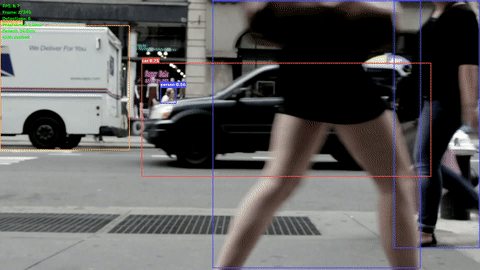
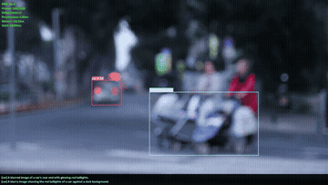
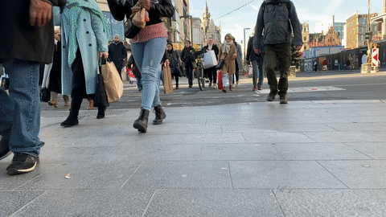
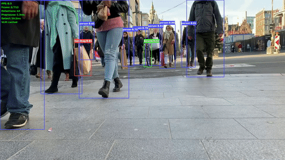

# Building an End-to-End Vision AI Pipeline on AMD Radeon with OpenCV 5

English | [中文](README_CN.md)

A fully GPU-accelerated vision AI pipeline running on AMD Radeon GPUs via ROCm/HIP, demonstrating:

- **OpenCV 5.x cv::cuda/HIP** — GPU-accelerated image preprocessing
- **MIGraphX FP16** — YOLO26x object detection on GPU (zero-copy)
- **Qwen3-VL + vLLM / llama.cpp** — Vision-Language Model scene understanding on GPU

```
Video Input
    │
    ▼
OpenCV 5 (cv::cuda / HIP)
  • warpAffine (letterbox)
  • cvtColor (BGR→RGB)
  • convertTo (normalize)
    │
    ▼
YOLO26x (MIGraphX FP16, zero-copy)
  • 300 detections × [x1,y1,x2,y2,score,class]
    │
    ▼
NMS (cv::cuda::nms, GPU) + ROI Crop (CPU on JPEG path / GPU on llamacpp-ipc path)
    │
    ▼
Qwen3-VL (vLLM or llama.cpp, ROCm/HIP)
  • Scene/object description per ROI
    │
    ▼
Overlay + Output Video
```

## Hardware Tested

| | Radeon Pro W7900 | Radeon RX (R9700) |
|---|---|---|
| GPU Arch | gfx1100 (RDNA3) | gfx1201 (RDNA4) |
| VRAM | 48 GB | 32 GB |
| ROCm | 7.2.1 | 7.2.1 |
| Container | `rocm/vllm-dev:rocm7.2.1_navi` | `rocm/vllm-dev:rocm7.2.1_navi` |

## Prerequisites

- ROCm 7.2.x installed on host
- Docker with GPU passthrough (`--device=/dev/kfd --device=/dev/dri`)
- Container: `rocm/vllm-dev:rocm7.2.1_navi_ubuntu24.04_py3.12_pytorch_2.9_vllm_0.16.0`
- Models:
  - YOLO26x ONNX model at `/home/yolo26x.onnx` (213 MB, input [1,3,640,640], output [1,300,6])
  - VLM weights, depending on backend:
    - **vLLM**: Qwen3-VL-8B-Instruct (HF format) at `/models/Qwen3-VL-8B-Instruct`
    - **llama.cpp**: GGUF weights + mmproj at `/models/` (e.g. `Qwen3-VL-8B-Instruct-Q8_0.gguf` + `mmproj-F16.gguf`; see Step 5b)

## Setup

### Step 1: Install System Dependencies

```bash
apt-get update && apt-get install -y ffmpeg libavcodec-dev libavformat-dev \
    libavutil-dev libswscale-dev pkg-config libpng-dev libjpeg-dev
pip install onnxruntime
```

### Step 2: Clone OpenCV 5.x with HIP Support

The `5.x-hip` branches contain Jeff Daily's HIP core patches (PR [#29285](https://github.com/opencv/opencv/pull/29285)) cherry-picked onto OpenCV 5.x, plus the 5.x compatibility fixes, `cv::cuda::nms`, and (contrib) the `align_corners` resize option needed by the zero-copy VLM path. No manual patches needed.

For `opencv_contrib` the demo uses the **`5.x-hip-zerocopy`** branch — it is `5.x-hip`
plus the `align_corners` commit ([opencv_contrib#4181](https://github.com/opencv/opencv_contrib/pull/4181)); `align_corners`
defaults to off, so it behaves identically to `5.x-hip` for everything except the
zero-copy `llamacpp-ipc` path. (Upstream the two are separate PRs: [#4178](https://github.com/opencv/opencv_contrib/pull/4178) HIP port + `cv::cuda::nms`, and [#4181](https://github.com/opencv/opencv_contrib/pull/4181) align_corners.)

```bash
cd /home
git clone -b 5.x-hip https://github.com/zhangnju/opencv.git
git clone -b 5.x-hip-zerocopy https://github.com/zhangnju/opencv_contrib.git
```

<details>
<summary>What the 5.x-hip branch patches (for reference)</summary>

The upstream `moat-port` branch targets OpenCV 4.x. The `5.x-hip` branch applies these fixes on top:

**a. Fix namespace doubling** — HIP compiler resolves `cv::cuda::` as `cv::cv::cuda::` inside `namespace cv {}`:

Files: `modules/cudev/include/opencv2/cudev/util/{vec_math,vec_traits,detail/type_traits}.hpp`

```diff
- using cv::cuda::device::compat::double4;
+ using ::cv::cuda::device::compat::double4;
```

**b. Guard DataType\<uint\> redefinition** — OpenCV 5.x core already defines `DataType<unsigned>`:

File: `modules/cudev/include/opencv2/cudev/util/vec_traits.hpp`

```cpp
#include "opencv2/core/version.hpp"
// ...
#if !defined(CV_VERSION_MAJOR) || CV_VERSION_MAJOR < 5
template <> class DataType<uint> { ... };
#endif
```

**c. Add VecTraits/MakeVec for 64-bit integers** — OpenCV 5.x uses `long`/`unsigned long` in GPU convertTo:

File: `modules/cudev/include/opencv2/cudev/util/vec_traits.hpp`

```cpp
// After CV_CUDEV_VEC_TRAITS_INST(double)
template <> struct VecTraits<long> { typedef long elem_type; enum {cn=1}; ... };
template <> struct VecTraits<unsigned long> { ... };

// After MakeVec<bool, 4>
template<> struct MakeVec<long, 1> { typedef long type; };
template<> struct MakeVec<long, 2> { typedef long type; };
template<> struct MakeVec<long, 3> { typedef long type; };
template<> struct MakeVec<long, 4> { typedef long type; };
// same for unsigned long
```

**d. Add saturate_cast base templates** for `long`/`unsigned long`:

File: `modules/cudev/include/opencv2/cudev/util/saturate_cast.hpp`

```cpp
// After saturate_cast(double v)
template <typename T> __device__ __forceinline__ T saturate_cast(long v) { return T(v); }
template <typename T> __device__ __forceinline__ T saturate_cast(unsigned long v) { return T(v); }
```

**e. Fix 5.x API moves**:

File: `modules/cudawarping/src/warp.cpp` — add `#include "opencv2/geometry/2d.hpp"` (invertAffineTransform moved to geometry module in 5.x)

**f. Remove duplicate stereo module** (moved to opencv core in 5.x)

**g. New GPU primitives / options added on top of the port (this project's contrib work):**

- `cv::cuda::nms` — GPU non-maximum suppression (class-aware IoU bitmask kernel), enabling GPU-resident detection post-processing. On `5.x-hip` / [opencv_contrib#4178](https://github.com/opencv/opencv_contrib/pull/4178).
- Fix for a duplicate `long`/`ulong` `VecTraits`/`MakeVec`/`saturate_cast` and a missing `CV_32U` `#endif` that broke a fresh 5.x-hip build. On `5.x-hip` / #4178.
- `align_corners` option for `cv::cuda::resize` (truncating-linear kernel, PyTorch/reference-bilinear parity) — required by the zero-copy `llamacpp-ipc` VLM path. Separate PR [opencv_contrib#4181](https://github.com/opencv/opencv_contrib/pull/4181); folded into the `5.x-hip-zerocopy` branch used above.

> Core-side (opencv main repo, [#29527](https://github.com/opencv/opencv/pull/29527)): the 5.x HIP compat fixes and `GpuMat.fromDevicePointer` (zero-copy wrap of external GPU memory) live on the `zhangnju/opencv` `5.x-hip` branch cloned in Step 2.

</details>

### Step 3: Build OpenCV 5.x with HIP

Replace `gfx1100` with your GPU architecture (`gfx1201` for RDNA4, etc.):

```bash
cd /home/opencv && mkdir build && cd build
cmake -DWITH_HIP=ON \
      -DCMAKE_HIP_ARCHITECTURES=gfx1100 \
      -DCMAKE_HIP_COMPILER=/opt/rocm/llvm/bin/amdclang++ \
      -DCMAKE_PREFIX_PATH=/opt/rocm \
      -DOPENCV_EXTRA_MODULES_PATH=/home/opencv_contrib/modules \
      -DWITH_CUDA=OFF -DWITH_OPENCL=ON -DWITH_FFMPEG=ON \
      -DBUILD_opencv_python3=ON \
      -DBUILD_opencv_hfs=OFF \
      -DBUILD_opencv_bioinspired=OFF \
      -DBUILD_opencv_dnn_superres=OFF \
      -DBUILD_opencv_wechat_qrcode=OFF \
      -DBUILD_opencv_img_hash=OFF \
      -DBUILD_opencv_tracking=OFF \
      -DBUILD_opencv_cudalegacy=OFF \
      -DBUILD_opencv_xobjdetect=OFF \
      -DBUILD_opencv_cudaobjdetect=OFF \
      -DBUILD_TESTS=OFF -DBUILD_PERF_TESTS=OFF \
      -DBUILD_EXAMPLES=OFF -DBUILD_DOCS=OFF \
      -DCMAKE_INSTALL_PREFIX=/opt/opencv5 \
      -DCMAKE_BUILD_TYPE=Release ..

cmake --build . -j$(nproc)
cmake --install .
```

Built modules include: `core cudaarithm cudabgsegm cudacodec cudafilters cudaimgproc cudawarping cudev dnn python3` and more.

### Step 4: Verify OpenCV HIP

```bash
PYTHONPATH=/opt/opencv5/lib/python3.12/site-packages python3 -c "
import cv2; print(cv2.__version__)
print('GPU devices:', cv2.cuda.getCudaEnabledDeviceCount())
"
```

Expected output:
```
5.1.0-dev
GPU devices: 1
```

### Step 5a: Start vLLM Server (default backend)

```bash
vllm serve /models/Qwen3-VL-8B-Instruct \
    --port 8198 --gpu-memory-utilization 0.8 \
    --max-model-len 4096 --tensor-parallel-size 1 \
    --trust-remote-code --dtype auto
```

Wait ~2 minutes for model loading. Verify with:

```bash
curl http://localhost:8198/v1/models
```

### Step 5b: Start llama.cpp Server (alternative backend)

llama.cpp supports AMD RDNA3/RDNA4 GPUs natively via ROCm/HIP and is a
lightweight alternative to vLLM — lower VRAM overhead, no Python runtime,
useful when running the full pipeline on a single GPU.

**Build llama.cpp with ROCm:**

```bash
git clone https://github.com/ggml-org/llama.cpp
cd llama.cpp

# RDNA3 (gfx1100, e.g. W7900 / RX 7900 XTX)
cmake -B build -DGGML_HIP=ON -DAMDGPU_TARGETS=gfx1100 -DCMAKE_BUILD_TYPE=Release
# RDNA4 (gfx1201, e.g. RX 9700)
cmake -B build -DGGML_HIP=ON -DAMDGPU_TARGETS=gfx1201 -DCMAKE_BUILD_TYPE=Release

cmake --build build --target llama-server -j$(nproc)
sudo cmake --install build
```

Or use the pre-built Docker image (already includes ROCm support):

```bash
docker pull ghcr.io/ggml-org/llama.cpp:server-rocm
```

**Download a vision GGUF model:**

```bash
# Qwen3-VL 8B Q8_0 — works on RDNA3 and RDNA4
huggingface-cli download unsloth/Qwen3-VL-8B-Instruct-GGUF \
    Qwen3-VL-8B-Instruct-Q8_0.gguf \
    mmproj-F16.gguf \
    --local-dir /models
```

**Start the server:**

```bash
bash start_llamacpp.sh \
    /models/Qwen3-VL-8B-Instruct-Q8_0.gguf \
    /models/mmproj-F16.gguf \
    8199
```

Verify with:

```bash
curl http://localhost:8199/v1/models
```

> **Multi-GPU note:** `llama-server` ignores `HIP_VISIBLE_DEVICES` — it always enumerates
> all cards and defaults to device 0. To pin it to a specific GPU, use its native flags:
> run `llama-server --list-devices` to see the `ROCm0..N` indices, then add
> `--device ROCmN`. Note that llama.cpp's `ROCmN` ordering may differ from `rocm-smi`'s
> `GPU[N]` and from the pipeline's `HIP_VISIBLE_DEVICES` index, so to co-locate the pipeline
> and the VLM server on the *same* physical card, confirm the mapping (e.g. watch
> `rocm-smi --showmemuse` while each process loads).

## Sample Videos

Download free test videos from [Pexels](https://www.pexels.com/) (CC0 license, no registration needed):

```bash
cd /home

# Street scene — pedestrians + passing cars (1080p, 25fps)
wget -O sidewalk.mp4 "https://videos.pexels.com/video-files/854100/854100-hd_1920_1080_25fps.mp4"

# Crossroad — people crossing + vehicles (1080p, 25fps)
wget -O crossroad.mp4 "https://videos.pexels.com/video-files/853743/853743-hd_1920_1080_25fps.mp4"

# Busy street — dense pedestrian traffic (1080p, 30fps)
wget -O street.mp4 "https://videos.pexels.com/video-files/3552510/3552510-hd_1920_1080_30fps.mp4"
```

Or generate a test video from the classic YOLO test image:

```bash
wget -O zidane.jpg "https://ultralytics.com/images/zidane.jpg"
ffmpeg -loop 1 -i zidane.jpg -t 2 -pix_fmt yuv420p -r 30 zidane_60f.mp4
```

## Running the Pipeline

```bash
cd /home/ocv_pipeline_demo
PYTHONPATH=/opt/opencv5/lib/python3.12/site-packages:/opt/rocm/lib \
    python3 pipeline.py --input /home/sidewalk.mp4 --output output.mp4
```

### Command-Line Options

| Flag | Default | Description |
|------|---------|-------------|
| `--input`, `-i` | (required) | Video file, RTSP URL, or camera index |
| `--output`, `-o` | `output.mp4` | Output video path |
| `--no-vlm` | off | Skip VLM stage entirely |
| `--vlm-backend` | (from config) | VLM backend: `vllm`, `llamacpp`, or `llamacpp-ipc` (zero-copy GPU image input via HIP IPC; falls back to `config.VLM_BACKEND`, currently `vllm`) |
| `--vlm-url` | (from config) | Override VLM server base URL |
| `--vlm-model` | (from config) | Override VLM model name (`auto` for llama.cpp auto-detect) |
| `--max-frames` | 0 (all) | Limit frames to process |
| `--vlm-interval` | 30 | Run VLM every N frames |
| `--device` | 0 | GPU device index |
| `--display` | off | Show cv2.imshow window (needs X11) |

**Examples:**

```bash
# Default: vLLM backend
python3 pipeline.py --input sidewalk.mp4 --output out.mp4

# llama.cpp backend (server already started on port 8199)
python3 pipeline.py --input sidewalk.mp4 --output out.mp4 \
    --vlm-backend llamacpp

# llama.cpp with custom URL and explicit model name
python3 pipeline.py --input sidewalk.mp4 --output out.mp4 \
    --vlm-backend llamacpp \
    --vlm-url http://localhost:8199/v1 \
    --vlm-model Qwen3-VL-8B-Instruct-Q8_0.gguf
```

### Environment Variables

| Variable | Default | Description |
|----------|---------|-------------|
| `HIP_VISIBLE_DEVICES` | all | Select GPU for the pipeline (e.g., `3` for 4th GPU). Note: `llama-server` ignores this — use its `--device ROCmN` flag instead (see Step 5b). |
| `YOLO_BACKEND` | `auto` | Force `migraphx` or `ort` |

## Demo

### sidewalk.mp4 — Pedestrians + USPS Truck

| Input | Output (YOLO26x + Qwen3-VL) |
|:-----:|:---------------------------:|
|  |  |

### crossroad.mp4 — People Crossing + Vehicles

| Input | Output (YOLO26x + Qwen3-VL) |
|:-----:|:---------------------------:|
|  |  |

### street.mp4 — Dense Pedestrian Traffic

| Input | Output (YOLO26x + Qwen3-VL) |
|:-----:|:---------------------------:|
|  |  |

## Test Results

### Test Videos

Three free [Pexels](https://www.pexels.com/) videos (CC0 license, 1920x1080) covering different street scenes:

| Video | Duration | FPS | Content | Typical Detections |
|-------|----------|-----|---------|--------------------|
| `sidewalk.mp4` | 15.7s (393 frames) | 25 | Pedestrians + USPS truck on city sidewalk | person, truck, car |
| `crossroad.mp4` | 24.5s (612 frames) | 25 | People crossing road + vehicles | person, car |
| `street.mp4` | 23.8s (712 frames) | 30 | Dense pedestrian traffic on busy street | 11-15 persons per frame |

### Performance: Without VLM (`--no-vlm`)

Tested on W7900 and R9700 with all three sample videos. **FPS is end-to-end wall-clock.**

**Fully GPU-resident path** (rocDecode hardware decode → zero-copy `cv::cuda` preprocess →
MIGraphX detect → `cv::cuda::nms` postprocess → VA-API hardware encode). The frame never leaves
the GPU on the hot path, so both the video I/O and the postprocessing overhead largely vanish.

**W7900 (gfx1100):**

| Video | Preprocess (GPU/HIP) | Detection (MIGraphX) | Postprocess (GPU NMS) | **FPS (end-to-end)** |
|-------|---------------------|---------------------|-------------|---------|
| `sidewalk.mp4` | 0.38 ms | 7.58 ms | 0.26 ms | **78.2** |
| `crossroad.mp4` | 0.34 ms | 7.35 ms | 0.16 ms | **82.4** |
| `street.mp4` | 0.34 ms | 7.49 ms | 0.31 ms | **79.0** |

**R9700 (gfx1201)** — RDNA4's faster MIGraphX detection (~5.7 ms vs ~7.5 ms) pushes the
end-to-end rate close to 100 fps on an unshared card:

| Video | Preprocess (GPU/HIP) | Detection (MIGraphX) | Postprocess (GPU NMS) | **FPS (end-to-end)** |
|-------|---------------------|---------------------|-------------|---------|
| `sidewalk.mp4` | 0.39 ms | 5.83 ms | 0.31 ms | **92.1** |
| `crossroad.mp4` | 0.35 ms | 5.65 ms | 0.18 ms | **98.7** |
| `street.mp4` | 0.36 ms | 5.76 ms | 0.37 ms | **94.8** |

**CPU video-I/O path** (`--video-decode cpu --video-encode cpu`, OpenCV FFmpeg + CPU NMS) — for
comparison. The gap is the `VideoCapture.read()` / `VideoWriter.write()` overhead and the host
upload in preprocessing:

| Video | **FPS (end-to-end)** | vs GPU path |
|-------|---------|-------------|
| `sidewalk.mp4` | 65.5 | +21% with GPU I/O |
| `crossroad.mp4` | 71.6 | +14% with GPU I/O |
| `street.mp4` | 62.9 | +27% with GPU I/O |

> The GPU-resident path drops preprocessing from ~1.7 ms to ~0.35 ms (zero-copy `GpuMat` over
> the decoded surface, no host upload) and keeps NMS on the GPU at ~0.2–0.3 ms. The bulk of the
> end-to-end speedup comes from moving video decode/encode onto the VCN engine.

### Performance: Full Pipeline with VLM (single-GPU)

Entire pipeline (YOLO/MIGraphX + VLM server) pinned to a **single GPU**, Qwen3-VL-8B,
GPU/HIP OpenCV, `--vlm-interval 30`. The VLM stage is **asynchronous** (fire-and-forget in a
background thread), so it does not block the main loop — the pipeline sustains real-time FPS
while VLM inference runs concurrently on the same card. The per-frame VLM time below reflects
the async **submit** cost (≈0–1 ms), *not* the real inference latency (see
[VLM Inference Latency](#vlm-inference-latency-r9700-single-gpu) for that).

**W7900 (gfx1100), fully GPU-resident path** (rocDecode + `cv::cuda` + MIGraphX +
`cv::cuda::nms` + VA-API, async llama.cpp Q8_0 VLM). Even with the VLM server sharing the card,
the main loop stays well above the 30 fps source rate:

| Video | **FPS** |
|-------|---------|
| `sidewalk.mp4`  | **41.3** |
| `crossroad.mp4` | **50.0** |
| `street.mp4`    | **45.6** |

**R9700 (gfx1201), fully GPU-resident path** (rocDecode + `cv::cuda` + MIGraphX + `cv::cuda::nms`
+ VA-API, async vLLM BF16 Qwen3-VL-8B co-located on the same card). The async VLM never blocks
the main loop; GPU contention lifts detection to ~11 ms but the pipeline still holds ~60 fps:

| Video | Preprocess (GPU/HIP) | Detection (MIGraphX) | Postprocess | **FPS** |
|-------|---------------------|---------------------|-------------|---------|
| `sidewalk.mp4`  | 0.64 ms | 11.97 ms | 0.58 ms | **57.7** |
| `crossroad.mp4` | 0.52 ms | 10.98 ms | 1.42 ms | **60.2** |
| `street.mp4`    | 0.54 ms | 11.08 ms | 1.54 ms | **58.8** |

The per-backend / per-stage tables below predate the GPU video-I/O and GPU-NMS work (they use
CPU video decode and show higher preprocess/postprocess times); they remain useful for comparing
VLM backends and the two GPUs.

**W7900 (gfx1100):**

| Video | VLM backend | Preprocess (GPU/HIP) | Detection (MIGraphX) | Postprocess | **FPS** |
|-------|-------------|---------------------|---------------------|-------------|---------|
| `sidewalk.mp4`  | vLLM BF16      | 1.69 ms | 10.13 ms | 0.29 ms | **53.0** |
| `crossroad.mp4` | vLLM BF16      | 1.62 ms |  9.71 ms | 0.69 ms | **57.3** |
| `street.mp4`    | vLLM BF16      | 1.54 ms | 11.80 ms | 1.27 ms | **46.2** |
| `sidewalk.mp4`  | llama.cpp Q8_0 | 2.94 ms | 13.74 ms | 1.10 ms | **41.6** |
| `crossroad.mp4` | llama.cpp Q8_0 | 2.79 ms | 10.26 ms | 1.19 ms | **51.1** |
| `street.mp4`    | llama.cpp Q8_0 | 3.13 ms | 12.19 ms | 1.35 ms | **42.2** |
| `sidewalk.mp4`  | llama.cpp BF16 | 3.19 ms | 14.83 ms | 1.01 ms | **39.5** |
| `crossroad.mp4` | llama.cpp BF16 | 3.29 ms | 11.85 ms | 1.11 ms | **46.6** |
| `street.mp4`    | llama.cpp BF16 | 3.66 ms | 14.14 ms | 1.31 ms | **38.5** |

**R9700 (gfx1201):**

| Video | VLM backend | Preprocess (GPU/HIP) | Detection (MIGraphX) | Postprocess | **FPS** |
|-------|-------------|---------------------|---------------------|-------------|---------|
| `sidewalk.mp4`  | vLLM BF16      | 1.34 ms | 11.87 ms | 0.74 ms | **46.8** |
| `crossroad.mp4` | vLLM BF16      | 1.23 ms | 10.48 ms | 1.17 ms | **52.4** |
| `street.mp4`    | vLLM BF16      | 1.33 ms | 10.64 ms | 1.33 ms | **47.1** |
| `sidewalk.mp4`  | llama.cpp Q8_0 | 2.22 ms | 12.13 ms | 1.09 ms | **44.0** |
| `crossroad.mp4` | llama.cpp Q8_0 | 2.19 ms | 11.58 ms | 1.25 ms | **47.6** |
| `street.mp4`    | llama.cpp Q8_0 | 2.54 ms | 12.50 ms | 1.47 ms | **40.8** |
| `sidewalk.mp4`  | llama.cpp BF16 | 2.34 ms | 13.86 ms | 0.92 ms | **40.7** |
| `crossroad.mp4` | llama.cpp BF16 | 2.57 ms | 13.99 ms | 1.20 ms | **42.1** |
| `street.mp4`    | llama.cpp BF16 | 2.91 ms | 16.15 ms | 1.43 ms | **35.2** |

All configurations exceed the 30 fps source rate (real-time), on both GPUs and all three
backends. FPS differences between backends come mainly from **GPU contention** — the
co-located VLM server shares the card with YOLO/MIGraphX, so a heavier VLM (BF16 > Q8_0;
llama.cpp keeps the GPU warmer than vLLM's sparse async calls) throttles detection somewhat.
This reflects real single-GPU deployment, not raw contention-free YOLO throughput (see the
no-VLM numbers above).

> GPU preprocessing requires the HIP-enabled OpenCV 5.x build on the Python path
> (`cv2.cuda.getCudaEnabledDeviceCount()` must return ≥ 1); otherwise the pipeline
> automatically falls back to CPU preprocessing.

### VLM Inference Latency (R9700, single GPU)

Real per-request VLM latency (the pipeline's async stats report only submit time, **not** the
actual inference latency). Measured against the llama.cpp server (Qwen3-VL-8B **Q8_0**), single
ROI image, `max_tokens=100`:

| Measurement | Latency | Notes |
|-------------|---------|-------|
| **Client end-to-end** (JPEG encode + base64 + HTTP + inference) | **582 ms** avg | median 570 ms, range 502–704 ms (8 runs) |
| Server-side total | 507–687 ms | from llama.cpp `print_timing` |
| ├─ Prompt eval (incl. image encode) | ~100–150 ms | 280–1150 tok/s |
| └─ Generation | ~400–540 ms | **~58 tok/s** (25–31 tokens) |

> The pipeline sends `VLM_TOP_K_ROIS=3` ROIs per VLM trigger. These requests are dispatched
> **concurrently** (see [Concurrent ROI Dispatch](#concurrent-roi-dispatch) below), so one full
> VLM cycle is well under 3× the single-ROI latency. The whole VLM stage also runs
> asynchronously every 30 frames, so the main loop still holds real-time FPS (40+ on R9700 with
> this Q8_0 backend; see the full-pipeline table above).

### VLM Backend Comparison (single-concurrency, single ROI)

Same model, single ROI, `max_tokens=100`, per-request latency (client end-to-end):

| GPU | Precision | Backend | Avg latency | Throughput |
|-----|-----------|---------|-------------|------------|
| **R9700 (gfx1201)** | Q8_0 | llama.cpp | **584 ms** | **46.5 tok/s** |
|                     | BF16 | llama.cpp | 1094 ms | 29.1 tok/s |
|                     | BF16 | vLLM | 1279–1322 ms | ~21 tok/s |
| **W7900 (gfx1100)** | Q8_0 | llama.cpp | **531 ms** | ~48 tok/s |
|                     | BF16 | llama.cpp | 721 ms | 35.7 tok/s |
|                     | BF16 | vLLM | 1397 ms | 20.9 tok/s |

> Single-concurrency, low-latency scenario (the demo fires one async VLM call every 30 frames).
> llama.cpp leads here on both GPUs; vLLM's continuous-batching advantage shows at higher
> concurrency. Output quality is equivalent across backends and precisions. Notably, W7900's
> larger VRAM (48 GB) and mature RDNA3 llama.cpp path give it slightly lower VLM latency than
> R9700, even though R9700 is faster on the CV/YOLO pipeline stages.

### Concurrent ROI Dispatch

Each VLM trigger describes the top-`VLM_TOP_K_ROIS` (default 3) detections. The client sends
those requests **concurrently** (a `ThreadPoolExecutor` over the per-ROI HTTP calls) so the
server can process them across its parallel slots via continuous batching, instead of
one-at-a-time. On the GPU-IPC path the GPU preprocess + IPC export still run serially per ROI
(cv::cuda / hipMalloc on a shared context are not thread-safe); only the HTTP requests are
parallelized — that's where the ~0.6 s/ROI latency lives.

Per-trigger latency for 3 ROIs (R9700, Q8_0, `max_tokens=100`, `llama-server --parallel 3`):

| Dispatch | Per-trigger latency (3 ROIs) | Speedup |
|----------|------------------------------|---------|
| Serial (3× sequential HTTP) | 2241 ms | 1× |
| **Concurrent (3× parallel HTTP)** | **1315 ms** | **1.70×** |

> The speedup is ~1.7×, not 3×: the server and pipeline share **one GPU**, so the vision-encoder
> + generation compute for the 3 requests is still largely serialized on the device — concurrency
> mainly overlaps prompt-eval and scheduling. It shortens each scene-description refresh, and
> since the VLM stage is async it never blocks the main loop's FPS.
>
> **`--parallel` VRAM tradeoff:** true concurrency needs `--parallel N` ≥ the number of ROIs
> (else extras queue), and each slot reserves its own KV cache. Going from `--parallel 2 -c 8192`
> to `--parallel 3 -c 12288` costs more VRAM — the very budget you capped to leave room for
> MIGraphX on a shared single GPU. Balance `--parallel` / `-c` against how much VRAM the
> co-located pipeline needs; on a dedicated VLM GPU you can raise both freely.

### Zero-Copy VLM Image Input (HIP IPC)

Normally each ROI is JPEG-encoded, base64'd, and sent to the VLM server over HTTP,
where it is decoded and CPU-preprocessed (resize/normalize) before the vision
encoder. The `llamacpp-ipc` backend removes all of that: the ROI stays on the GPU,
is preprocessed on the GPU with `cv::cuda` (numerically identical to llama.cpp's
CPU preprocess — verified element-wise), and is shared with the co-located
llama-server via a **HIP IPC handle**. Only a 64-byte handle travels over HTTP; the
server maps the same VRAM and feeds the vision encoder directly — no JPEG, no
pixel copy to the host, no server-side preprocess.

This backend needs a llama-server built from the **`vlm_zerocopy` branch of the
[zhangnju/llama.cpp](https://github.com/zhangnju/llama.cpp/tree/vlm_zerocopy)
fork**, which adds the HIP-IPC / preprocessed-image path to the multimodal server
(`server-ipc.{cpp,h}` + an `mtmd_bitmap_init_preprocessed` bypass). Stock
`ggml-org/llama.cpp` only supports the JPEG `llamacpp` backend above.

```bash
# build the patched server (same ROCm/HIP flags as the stock build in Step 5b)
git clone -b vlm_zerocopy https://github.com/zhangnju/llama.cpp.git
cd llama.cpp
cmake -B build -DGGML_HIP=ON -DAMDGPU_TARGETS=gfx1201 -DCMAKE_BUILD_TYPE=Release  # gfx1100 for W7900
cmake --build build --target llama-server -j$(nproc)

# start it (single-GPU: cap KV cache so the pipeline's MIGraphX has room)
HIP_VISIBLE_DEVICES=2 ./build/bin/llama-server \
    -m /models/Qwen3-VL-8B-Instruct-GGUF/Qwen3-VL-8B-Instruct-Q8_0.gguf \
    --mmproj /models/Qwen3-VL-8B-Instruct-GGUF/mmproj-F16.gguf \
    -ngl 99 -c 8192 --parallel 2 --port 8199 --host 0.0.0.0

# run the pipeline on the SAME physical GPU
python3 pipeline.py --input street.mp4 --vlm-backend llamacpp-ipc \
    --vlm-url http://localhost:8199
```

> The pipeline and llama-server **must share the same physical GPU** (HIP IPC maps
> VRAM within one device). Bit-exact preprocess parity with the server relies on the
> `align_corners` option in `cv::cuda::resize`
> ([opencv_contrib#4181](https://github.com/opencv/opencv_contrib/pull/4181)), which
> is already included if you cloned the `5.x-hip-zerocopy` contrib branch in Step 2.

**Client-side image ingestion cost** — the part zero-copy actually changes (the
per-image work to get pixels ready to send). JPEG encode+base64 scales with
resolution; the IPC path is a flat 64-byte handle:

| Image size | JPEG encode+base64 | IPC export | Speedup | HTTP payload |
|-----------|-------------------|-----------|---------|--------------|
| 320×240   | 0.17 ms | 0.09 ms | 1.8× | 415× smaller |
| 640×480   | 0.73 ms | 0.27 ms | 2.7× | 1396× smaller |
| 1280×720  | 2.02 ms | 0.41 ms | 4.9× | 3235× smaller |
| 1920×1080 | 4.33 ms | 0.50 ms | **8.6×** | 6383× smaller |
| 3840×2160 | 13.53 ms | 1.01 ms | **13.4×** | **14220× smaller** |

> JPEG encoding grows ~linearly with resolution (13.5 ms at 4K), while the IPC
> export stays essentially constant (always an 88-byte base64 handle). The bigger
> the frame, the bigger the win; the transferred payload shrinks by 3–4 orders of
> magnitude (4K: 1.2 MB base64 → 88 bytes).
>
> **When it matters:** the end-to-end gain at the demo's default load
> (interval-30, one small ROI) is negligible because the VLM's vision-encoder
> forward dominates. The zero-copy path pays off with **large (4K) frames, many
> ROIs per request, or client-CPU / bandwidth-constrained multi-stream
> deployments**, where per-image JPEG encode and MB-scale transfer would otherwise
> saturate the CPU/NIC.

### VLM Scene Understanding Examples

Qwen3-VL generates natural language descriptions for the top-3 detected ROIs every 30 frames. Example output from `sidewalk.mp4` frame 1:

| Detection | VLM Description |
|-----------|----------------|
| person 0.96 | *"A blurred image captures the lower half of a person walking on a city sidewalk."* |
| truck 0.94 | *"A white United States Postal Service delivery truck with the slogan 'We Deliver For You' is captured in motion on a city street."* |
| person 0.93 | *"A person in a black shirt and dark jeans walks past a fire hydrant on a city sidewalk."* |

### Cross-GPU Comparison

Per-stage **compute time only** (excludes video decode/encode I/O), so the derived FPS is
higher than the end-to-end `--no-vlm` numbers above. Use this table to compare raw GPU
compute across architectures; use the end-to-end tables for real throughput.

| Stage | W7900 (gfx1100) | R9700 (gfx1201) | Backend |
|-------|-----------------|-----------------|---------|
| GPU Preprocess | **1.93 ms** | 2.45 ms | OpenCV 5.x cv::cuda/HIP |
| YOLO Detection | **6.82 ms** | 5.34 ms | MIGraphX FP16 zero-copy |
| Postprocess | 0.34 ms | 0.66 ms | CPU (NMS + draw) |
| **Total FPS (compute only, no VLM)** | **91.9** | **91.1** | |

### MIGraphX vs PyTorch GPU (W7900)

YOLO26x inference benchmark (100 runs, input [1,3,640,640]):

| Backend | Latency | FPS | Speedup |
|---------|---------|-----|---------|
| PyTorch GPU FP32 | 18.49 ms | 54 | 1x |
| PyTorch GPU FP16 | 11.52 ms | 87 | 1.6x |
| MIGraphX FP32 (zero-copy) | 17.33 ms | 58 | 1.1x |
| MIGraphX FP16 (zero-copy) | **6.30 ms** | **159** | **2.9x** |

## Key Technical Details

### MIGraphX Zero-Copy Inference

Standard MIGraphX `to_gpu()` calls `hipHostRegister` which may fail on some GPU configurations. This pipeline uses the GPU-resident zero-copy pattern from the [AMD blog](https://rocm.blogs.amd.com/artificial-intelligence/gpu-resident-yolo26/README.html):

```python
# Compile with offload_copy=False — no automatic host copies
model.compile(migraphx.get_target("gpu"), offload_copy=False)

# Pre-allocate output tensor on GPU via PyTorch
output_tensor = torch.empty(output_shape.lens(), dtype=torch.float32, device="cuda")
mgx_output = migraphx.argument_from_pointer(output_shape, output_tensor.data_ptr())

# Wrap PyTorch GPU input pointer directly — no hipHostRegister
mgx_input = migraphx.argument_from_pointer(input_shape, input_tensor.data_ptr())

# Execute on HIP stream — fully GPU-resident
model.run_async({...: mgx_input, ...: mgx_output}, stream.cuda_stream, "ihipStream_t")
```

### OpenCV 5.x + HIP Compatibility

Porting the cv::cuda HIP backend from 4.x to 5.x required fixing:

1. **Namespace resolution** — `cv::cuda::` → `::cv::cuda::` in device headers (HIP compiler is stricter than NVCC)
2. **Type redefinitions** — `DataType<uint>` guarded for 5.x which already defines `DataType<unsigned>`
3. **64-bit integer support** — Added `VecTraits`, `MakeVec`, `saturate_cast` for `long`/`unsigned long`
4. **Transform policy** — Force `shift=1` for 64-bit types to avoid vectorized path (no `long4` in HIP/CUDA)
5. **API moves** — `invertAffineTransform` moved to `opencv2/geometry/2d.hpp` in 5.x

## Project Structure

```
ocv_pipeline_demo/
├── pipeline.py          # Main orchestrator — frame loop
├── preprocess.py        # GPU preprocessing (cv::cuda warpAffine/cvtColor/convertTo)
├── detector.py          # YOLO26x detection (MIGraphX GPU or ONNX Runtime fallback)
├── vlm_client.py        # VLM clients: VLMClient (vLLM), LlamaCppVLMClient, AsyncVLMClient
├── postprocess.py       # NMS, bounding box overlay, VLM text rendering
├── config.py            # Paths, thresholds, model parameters, VLM_BACKEND selection
├── start_vllm.sh        # Launch vLLM server (Qwen3-VL)
├── start_llamacpp.sh    # Launch llama.cpp server (GGUF vision models, ROCm/HIP)
├── setup_env.sh         # One-time environment setup
└── README.md            # This file
```

## Source Code

- **OpenCV 5.x + HIP (core):** [zhangnju/opencv](https://github.com/zhangnju/opencv) branch `5.x-hip` — 5.x HIP compat + `GpuMat.fromDevicePointer`
- **opencv_contrib (HIP):** [zhangnju/opencv_contrib](https://github.com/zhangnju/opencv_contrib) branch `5.x-hip-zerocopy` — `5.x-hip` (HIP port + `cv::cuda::nms` + 5.x fixes) **plus** `align_corners`; use this branch for the demo
- **llama.cpp (zero-copy VLM server):** [zhangnju/llama.cpp](https://github.com/zhangnju/llama.cpp/tree/vlm_zerocopy) branch `vlm_zerocopy` — needed only for the `--vlm-backend llamacpp-ipc` path

**Upstream pull requests:**

- OpenCV core HIP: [opencv/opencv#29527](https://github.com/opencv/opencv/pull/29527) (base HIP port PR [#29285](https://github.com/opencv/opencv/pull/29285))
- opencv_contrib HIP port + `cv::cuda::nms`: [opencv/opencv_contrib#4178](https://github.com/opencv/opencv_contrib/pull/4178) (base [#4147](https://github.com/opencv/opencv_contrib/pull/4147))
- opencv_contrib `align_corners` resize: [opencv/opencv_contrib#4181](https://github.com/opencv/opencv_contrib/pull/4181)
